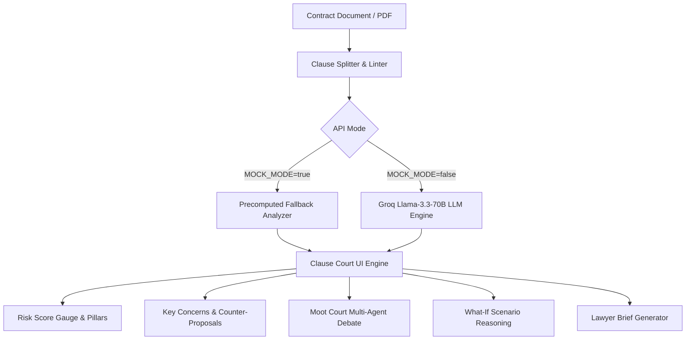

<div align="center">

# ⚖️ Clause Court

### *AI-Powered Contract Sparring Partner & Risk Intelligence Engine*

[](https://clause-court.vercel.app)
[](https://react.dev)
[](https://www.typescriptlang.org)
[](https://tailwindcss.com)
[](https://groq.com)
[](LICENSE)

<br />

**[🌐 Live App](https://clause-court.vercel.app)** • **[🎬 Demo Script](#-video-demo--walkthrough)** • **[⚡ Quick Start](#-quick-start)** • **[🏗 Architecture](#-architecture--pipeline)**

<br />

<p align="center">
  <b>Clause Court protects non-lawyers from predatory contract traps</b> by providing document-grounded legal risk analysis, adversarial Moot Court simulations between tenant & landlord AI advocates, what-if scenario stress-testing, and instant lawyer brief generation.
</p>

</div>

---

> ⚠️ **Legal Disclaimer:** Clause Court is an informational AI legal assistant designed for risk awareness and contract sparring. It does **not** provide formal legal advice. Always consult a licensed attorney.

---

## ✨ Key Capabilities

| Feature | Description | GenAI Tech |
| :--- | :--- | :--- |
| **🚨 Visual Risk Score Gauge** | 0–100 risk score breakdown across 4 liability pillars (Financial, Indemnity, Traps, Ambiguity). | Heuristic & LLM Scoring |
| **🔍 Verbatim Quote Hazards** | Pinpoints exact high-risk quotes, translates legalese, and generates ready-to-copy counter-proposals. | Llama-3.3-70B Extraction |
| **⚔️ Moot Court AI Sparring** | Live streaming debate between AI Tenant & Landlord Advocates judged by an AI Magistrate. | Multi-Agent LLM Debate |
| **🔮 What-If Scenario Tester** | Stress-tests real-world scenarios (*"What if I leave after 4 months?"*) against contract terms. | Scenario Reasoning Engine |
| **📄 Split Inspector Workspace** | Side-by-side synchronized view linking risk highlights directly to full contract text. | Interactive UI Synchronization |
| **📋 Lawyer Brief Exporter** | Executive Summary generation with 8 tailored legal questions for your attorney. | Structuring & Summarization |

---

## 🎯 Problem Statement Alignment

### The Problem: Asymmetric Legal Power & Hostile Contracts
Non-lawyers—freelancers, residential and commercial tenants, small business operators, and independent contractors—routinely sign complex legal agreements containing severe, asymmetric liabilities without understanding the fine print. Retaining legal counsel for routine contract reviews costs **$300 to $800+ per hour**, leaving over 90% of non-lawyers exposed to predatory contractual traps:
- **Uncapped Indemnities**: Shifting financial liability for counterparty negligence or third-party claims onto the signatory.
- **Silent Auto-Renewals**: Strict 60-to-90 day opt-out windows locking signatories into costly multi-year commitments.
- **Unilateral Fee Shifting & Deposit Forfeitures**: Aggressive liquidated damage clauses allowing immediate forfeiture of deposits without notice or cure periods.
- **Dangling Cross-References & Ambiguities**: Obscure references to external house rules or unspecified policy manuals.

### How Clause Court Solves It
Clause Court serves as an **AI-powered contract sparring partner** that levels the playing field:
1. **Document-Grounded Hazard Detection**: Extracts exact verbatim dangerous quotes without hallucinations.
2. **Plain-Language Demystification**: Translates opaque legal jargon into tangible business, financial, and personal risks.
3. **Adversarial Moot Court Simulation**: Pits AI legal advocates against each other so users observe the real arguments a court or arbitrator would hear.
4. **Actionable Counter-Proposals**: Generates equitable replacement phrasing ready to paste into counter-offers.
5. **Executive Lawyer Brief**: Equips users with a structured, 1-page summary and 8 prioritized attorney questions if professional review is warranted.

---

## 🤖 GenAI Integration Architecture

Clause Court deeply weaves Generative AI into every layer of its legal intelligence pipeline:

| GenAI Component | Model / Engine | Prompt Strategy & Function | Output / Artifact |
| :--- | :--- | :--- | :--- |
| **Document Risk Extraction Engine** | Groq Llama-3.3-70B (`llama-3.3-70b-versatile`) / Gemini 3.8 Flash | Zero-shot legal risk classification inside `<document>` boundary tags; strict JSON schema enforcement | 0–100 Risk Score, 4-pillar liability breakdown, verbatim risk quotes |
| **Multi-Agent Moot Court Chamber** | Multi-Turn LLM Dialogue Engine | 3 distinct adversarial roles: **Tenant Advocate** (consumer protection), **Landlord Advocate** (strict enforcement), **Neutral Magistrate** (judicial arbitration) | Live streaming adversarial arguments, evidence grounding, confidence-scored verdict |
| **What-If Scenario Reasoning Engine** | Contextual Counterfactual Evaluator | Maps hypothetical breach scenarios (*"What if I terminate early due to health?"*) against document covenants | Concrete liability consequences, financial exposure assessment |
| **Equitable Counter-Proposal Synthesizer** | Legal Prompt Engineering | Transforms unilateral covenants into balanced, bilateral contract language | Drop-in substitute contract clauses |
| **Lawyer Brief Markdown Synthesizer** | Structured Document Summarizer | Distills audit results into executive summary, risk breakdown, and 8 consultation questions | Downloadable/printable 1-page `.md` briefing dossier |

### GenAI Security & Guardrails
- **Prompt Injection Defense**: All user-provided contract text is isolated inside `<document>` delimiters with input length enforcement to prevent system prompt injection or context overflow.
- **Strict Verbatim Evidence Grounding**: The LLM is explicitly constrained to cite verbatim substrings from the source document, preventing hallucinations.
- **Deterministic Heuristic Fallback**: In offline or zero-API environments, a deterministic regex/rule engine activates seamlessly to ensure continuous operation.

---

## 📸 Core Interface & Workflow

```
┌────────────────────────────────────────────────────────────────────────────────┐
│  ⚖️ CLAUSE COURT — CONTRACT RISK & MOOT COURT AGENT                              │
├────────────────────────────────┬───────────────────────────────────────────────┤
│ 📊 Risk Score: 88 / 100         │ 🛡️ KEY CONCERNS & COUNTER-PROPOSALS            │
│ 🔴 CRITICAL RISK DETECTED      │ ───────────────────────────────────────────── │
│                                │ 1. Uncapped Indemnity for Landlord Negligence │
│ • Financial Exposure: 85/100   │    Quote: "Tenant indemnifies Landlord..."    │
│ • Liability Trap:     92/100   │    Counter: "Indemnity capped at $5,000..."    │
│ • Ambiguity Level:    74/100   │                                               │
├────────────────────────────────┴───────────────────────────────────────────────┤
│ ⚔️ MOOT COURT SIMULATION:                                                       │
│ 🔵 Tenant Advocate: "Clause 4 violates consumer protection standards..."       │
│ 🔴 Landlord Advocate: "Standard commercial risk allocation is enforceable..."   │
│ ⚖️ AI Magistrate Verdict: CONTESTED / AMBIGUOUS (85% Confidence)              │
└────────────────────────────────────────────────────────────────────────────────┘
```

---

## ⚡ Quick Start

### 1. Clone & Install Dependencies

Ensure you have **Node.js 18+** installed:

```bash
# Clone the repository
git clone https://github.com/kido449/clause-court.git
cd clause-court

# Install npm packages
npm install
```

### 2. Configure Environment

Copy `.env.example` to `.env`:

```bash
cp .env.example .env
```

Edit your `.env` parameters:

```env
GROQ_API_KEY="gsk_your-groq-api-key"
MODEL_NAME="llama-3.3-70b-versatile"
MOCK_MODE="false"
```

> 💡 **Zero-Key Offline Demo:** Set `MOCK_MODE="true"` to run 100% offline with zero external network dependencies!

### 3. Run Development Server

```bash
npm run dev
```

Visit `http://localhost:3000` in your web browser.

---

## 🏗 Architecture & Pipeline



### Tech Stack Details

- **Frontend**: React 19, TypeScript, Tailwind CSS 4, Lucide Icons, Canvas Confetti
- **Build System**: Vite 8.3
- **API Server Middleware**: Express API (`server/api.ts`)
- **LLM Engine**: Groq API (`llama-3.3-70b-versatile`) with OpenAI SDK compatibility
- **Python Service (Optional)**: FastAPI Service (`backend/app/main.py`)

---

## 🎬 Video Demo & Walkthrough

Check out our under-4-minute demo walkthrough script or test the live app flow:

1. **Load Commercial Lease**: Watch the visual Risk Meter animate to `88/100`.
2. **Review Key Concerns**: Inspect verbatim quotes, risk ratings, and counter-proposals.
3. **Launch Moot Court**: Click **Simulate Moot Court** to watch live AI streaming legal arguments.
4. **Export Brief**: Generate a structured Executive Summary with prioritized attorney questions.

---

## 📄 License

Distributed under the MIT License.

---

<div align="center">
  <sub>Built with ❤️ for non-lawyers everywhere • Powered by Groq & Llama-3.3</sub>
</div>
